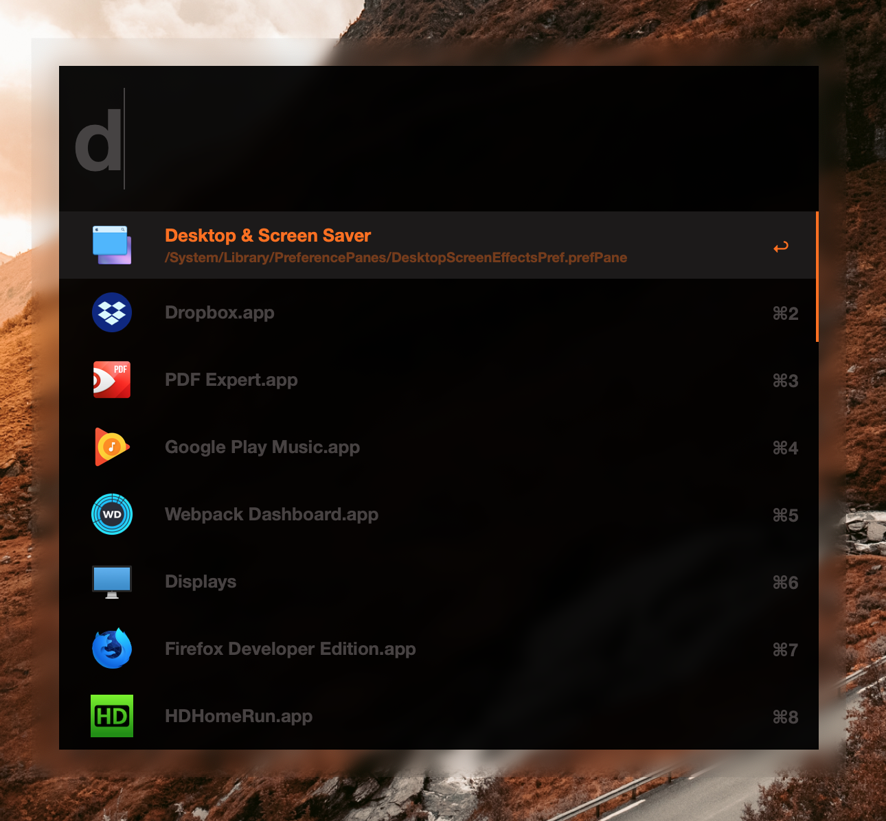

# Metro for Alfred

A pretty nice theme for Alfred. Meant for Alfred 4.

[Download the latest release here](https://github.com/qbunt/alfredmetro/releases/download/v1/metro.alfredappearance)

## Installation
1. [Download this file](https://github.com/qbunt/alfredmetro/releases/download/v1/metro.alfredappearance)
1. Drag & drop this into the Alfred appearance window
1. Click 'import'

## License
[MIT](LICENSE)

## Notes
If you end up using this theme and liking it, but made some tweaks, shoot me a PR.
